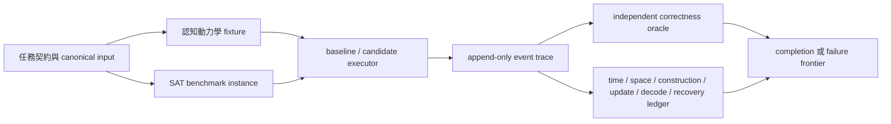

# AI-4 Phase 0｜P/NP 動態四層閉合工程章程

- 狀態：`Phase 0 complete / proposal / unadopted`
- 角色：AI-4 演算法與工程現實審計
- 日期：2026-08-09（Asia/Taipei）
- 協調座標：`ctcl:instant:b8ce3d5a-9369-4c60-8436-737ecd818ac7`
- CTCL 用途：只作共同起始時間座標，不作論證權威，也不以 AI Board `ts` 代替。
- 研究優先序：認知動力學為主軌；傳統計算機 P/NP 為高效益實證軌。
- 邊界：本輪唯讀；未修改研究原稿、研究鏡像或公開站；未宣稱採納任何框架，也未建立大型工程。

## 1. Phase 0 結論

最小可行方向不是先寫「通用壓縮器」，而是先建立一個共用、可重放的事件與成本帳本，讓兩條軌道接受同一套審計：



第一個可執行 MVP 應是 `I0: Claim-Ledger + PARITY Admission + 2-SAT`：

1. 認知軌用一個封閉世界的「研究 claim-ledger 修復」微基準，實際測狀態切換、表示改寫、rollback、rerouting、自我修正、語義損失債務及完成判定。
2. admission 軌加入 AI-2 提出的 PARITY 正／反例雙族，驗證終態相同時，完整 provenance、uniformity 與 advice 帳仍能拒絕答案表偷渡。
3. 演算法軌只先做可獨立驗證的 2-SAT SCC baseline，證明共用 schema、計時、證書、重放與 recovery 帳本可運作。
4. quotient、abstraction、refinement、portfolio switching 全部延後；在 baseline 與 oracle 未通過前，不比較加速。

## 2. 唯讀來源與版本錨點

### 2.1 必讀核心

| 來源 | 版本／範圍 | SHA-256／狀態 | 本輪用途 |
|---|---|---|---|
| `P_NP_數學構造狀態機中介層_v1.0.md` | v1.0 | `CBABB2C369B1765B59036EC480B2DC2F0F0955E5BB1EA60232466CAF8914F2ED` | discovery→formalization→construction→realization→run→verification 與 genesis/use 成本分離 |
| `P_NP_對偶證明預演研究區_截至第二十四輪.zip` | 第 1–24 輪完整快照 | `88AB3A7F396CEAFF353D7CE3DAEB771B057E658C8760253ABAB17E85825FEB0D` | 表示逃逸、商化／橋接債務、pathwise accounting、QCM、WQO、AOT、PEO 與 CEGAR 終止債務 |
| `P_NP_動態四層閉合框架_啟發式研究提案_v1.0.md` | v1.0 | `E1D35DE165C7BA7848521DFE79D4EBD1A84C8683D99E9069533889DDB1B9B186` | GCC/USRT/USEG/GLC 候選定義、量詞與 admissible model |
| `P_NP_動態四層閉合框架_研究交接與後續實行建議_v1.0.md` | v1.0 | `34C5A9EDA10C75986527ADD6197FC1828359402F5CE7DF32B9F9655C5EA621E8` | benchmark、Observatory 與 ledger 建議 |
| `P_NP_動態四層閉合框架_GLC優先研究交接與實行建議_v1.0.md` | v1.0 | `6654E6645AB360BDA22A8F81CD22698938BF7DA8D2AB4DF25D88DF31CC793076` | GLC0、standard/robust completion 與最終帳本 |
| [P/NP 對偶預演公開頁](https://amral.evemisslab.com/p-np-dual/) | 2026-08-09 擷取，HTTP 200 | HTML SHA-256 `40D4BC11C37C75F87C76E07EFDCBDB2561C65A1D44E03D9A5D1B2000734FACC2` | 公開定位：雙假設預演，不是證明 |
| [GLC framework 公開頁](https://amral.evemisslab.com/glc-framework/) | 2026-08-09 擷取，HTTP 200 | HTML SHA-256 `B2FA571C02D8FF7C91CFB0901C53ED3058816C27602A49015F9399D592AAF8A2` | 「過程自由、最終帳本不自由」及非證明聲明 |
| AI-2 Phase 0 紅隊章程與 PARITY 接口 | v0.1；授權跨任務封包 | `AA232A91DC92D09846978D081DF6457559561FF1B3395263385BDD9922981307` | pointwise inf、終態不可區分、uniform provenance/advice admission gate |

原始核心位於 `D:\我的研究\學術討論\論文\數學\p=np專區\P_NP_數學構造狀態機`。`D:\Ai\work together\P_NP_GLC` 中五個核心檔案與原始檔逐一雜湊一致；該目錄是研究鏡像，不是實作目錄。

封存包與公開 `p-np-dual` 是兩個 provenance snapshot，不得合併為單一位元版本。對 00–24 共 25 篇逐檔比較，22 篇相同；08、18、23 的雜湊不同。差異是 LaTeX escape/control-character 修正：08 的 `\neq`、18 的 `\text`、23 的 `\boxed` 公開字形已修正。本章的概念閱讀採公開修正字形，但任何 run 必須明列自己引用的是 archive hash 或 public hash。

### 2.2 認知動力學定向材料

本輪只抽取與工程接口直接相關的材料，不承接其「命題／猜想」為定理：

| 文件 | 版本 | SHA-256 | 抽取接口 |
|---|---|---|---|
| `認知狀態的層級解耦與跨狀態重建不對稱_v2.0.md` | v2.0 | `570B5A86D2CB1862036972AE1E58B42E23A25FFB0D158E0F76E8E210533FA06D` | 任務相對狀態向量、多尺度切換、有限可識別性、失效條件 |
| `反身狀態閘控論_高階智能的自我封印最佳認知區間與可恢復狀態控制_v0.1.md` | v0.1 | `7064BD217150D4418B90D869A15B75DA177906F3CC25BE411DE2E7AD2695CA71` | working/guardian 分離、gating、restore、merge、GG/OSR/RF 實驗 |
| `16_跨時自我與生成連續性_錯得起回得來帶得走.md` | 系列 16 | `0CFABB40547F6512505467DEF26B9DA1C507652D2E1473AFC9FD54B366FD4238` | inheritance packet、失敗知識、branch-aware state、auditable revision |
| `無限遞歸改良動力學_觀測診斷生成驗證與提交_v0.1.md` | v0.1 | `AE12C413F7677142092ACEA9FEACB17C62B0CA78396C6B3750E47AC2462AA184` | observe→diagnose→plan→generate→verify→benchmark→commit→learn 閉環 |
| `功能不變如何被證明_等價證書差分驗證與安全回滾_v0.1.md` | v0.1 | `7D1F4120650AAD9E1A5EAFDE343AB6D26EA77D1473952FE4101A82F408463F5C` | 有適用域的證書、獨立 oracle、完整 rollback、驗證債務 |
| `類終極智慧體的動態窄道猜想_可行管道修正寬度成功增權與外部可糾正性_v0.1.md` | v0.1 | `DF3D8E2DB8BDB5E9F76C5DA3D77029BBA874BDCD84F5F22BB2C99341752C3F27` | viable/recoverable set、不可逆前回饋、外部可糾正性、評價器俘獲 |

## 3. 證據與標籤規則

每項研究物件必須使用下列其一，並保存來源、版本、適用域、量詞、假設與失敗條件：

| 標籤 | 本工程中的含義 | 例子／限制 |
|---|---|---|
| Definition | 本工程採用的語彙或資料契約；不是關於世界的真命題 | 下節的 `final_completion` 與 semantic-loss debt |
| Observation | 在特定材料、程式或實驗中觀察到的事實 | syntax WQO 不自動保存 SAT correctness |
| Lemma | 有獨立 proof obligation 的局部結果 | WQO 中 upward-closed set 有 finite basis；適用域不包含「所有演算法語義」 |
| Conditional | 明列前件才成立的推論 | 若對所有 SAT instance 的 build+solve+decode 都為 uniform polynomial 且正確，則得到 P=NP |
| Conjecture | 尚未證成、可被削弱或拒絕的主張 | `∃T,∃g≠1` 使 gated state 優於 full-state |
| Counterexample | 擊敗某個明確量詞或推論的物件 | 兩點「完美抽象」可把 oracle 藏進 abstraction map；表示小不代表構造容易 |
| Experiment | 有限樣本、固定版本與量測程序 | 本章的 I0；只能支持或削弱機制效用 |
| Open Problem | 尚無 theorem 或完整實驗解答 | general SAT 上非循環、有限收斂的 refinement theorem |

舊稿出現「證明」「定理」「命題」時，本工程不直接繼承其地位；只有經獨立 proof review、量詞與適用域對齊後才可升格。

## 4. 共用執行語義

### 4.1 Definition：事件化狀態

一個工程狀態定義為：

\[
X_t=(W_t,G_t,R_t,B_t,O_t,Q_t)
\]

- `W_t`：可被切換或改寫的 working state。
- `G_t`：不被同一工作策略完全覆寫的 guardian/checkpoint state。
- `R_t`：當前 representation 與其版本／hash。
- `B_t`：active、archived、superseded、reopenable branches。
- `O_t`： correctness、decode、provenance 等尚未解除的 obligations。
- `Q_t`：完整資源帳與剩餘 budget。

每次切換、改寫、refine、rollback、reroute、decode 或 commit 都產生 append-only event，保存前後狀態 hash、表示 hash、債務變化及本步成本。

### 4.2 Definition：外部 admission judgment

`admission_pass` 不是 candidate run 的輸出欄，而是固定版本、content-addressed 的外部 validator 在 run 結束後，根據 capability sandbox、trace、resolved Build/Step/Decode/invariant refs 與完整資源帳導出的 postcondition。Schema 將 decision source 固定為 `external-validator`，並分列 ref resolution、builder execution、advice generation、proof verification、resource budget、oracle-free 與 replay gates。`admissible` 不能反過來定義成「會被 validator 接受的 run」；admissible run class 必須先由獨立模型／scheduler／fault 規格給出。

`answer_access` 也不是 candidate 自述；它必須由能力沙箱禁止／允許的接口及 trace observation 共同決定。任何 unresolved ref、未執行 proof check 或不可重建 builder 都使 admission 失敗或保持 `unknown`。

### 4.3 Definition：有效序列

`effective_sequence` 是有限編碼的事件序列 `e_0…e_k`，每一步都有可執行轉移、輸入／輸出 hash、局部成本與可驗證前置條件。這個定義不蘊含總長度、多項式時間或最終收斂；stepwise cheap 也不代表 pathwise cheap。

### 4.4 Definition：語義損失債務

`semantic_loss_debt` 是在表示改寫、摘要、gating 或 branch pruning 時，已登記但尚未由證據解除的「任務相關語義義務」集合。零債務表示所有**已登記且由契約要求**的義務均已退休，不表示 bit-level 零資訊損失，也不允許藉縮小 obligation registry 取得假零。

每筆債務至少包含：來源事件、被省略／合併的內容、契約關聯、解除條件、狀態與退休證據。

### 4.5 Definition：最終完成

標準完成定義：

\[
FC_{std}:=Terminated\land AdmissionPass\land OraclePass\land ContractPass\land Complete
\land DebtOpen=0\land BudgetPass.
\]

`terminated`、`no counterexample yet`、`internally consistent` 或 `faster` 均不單獨等於完成。

穩健版本必須先明示 perturbation/fairness class `𝓡`，再定義：

\[
FC_{robust}:=\forall r\in\mathcal R,\ FC_{std}(r).
\]

有限實驗只能測已列舉的 `r`；不能把抽樣通過寫成全稱 theorem。

工程記錄另把兩個軸分開，不重用 `std` 表示資源界：

|  | standard/canonical run | admissible maximal fair runs |
|---|---|---|
| resource-neutral | `GLC0_std` | `GLC0_robust` |
| resource-bounded | `GLCpoly_std` | `GLCpoly_robust` |

`admissible` 管允許的安全／故障邊界，`fair` 管活性；兩者都不能用「最後會完成」來定義。robust run class 必須有 non-empty guard，否則全稱式可真空成立；finite prefix 也不能冒充 maximal run。

### 4.6 共用資源帳

每個 baseline 與 candidate 都必須填滿最小六欄：

\[
\mathcal L=(T_{total},S_{peak},C_{construct},C_{update},C_{decode},C_{recovery})
\]

並把下列欄位顯式拆出：`generation`、`lift`、`verify`、`restart`、`parallel_work`、oracle 成本、artifact size、program/code/advice/generated-table/proof bytes、peak precision bits、states/branches/switches/rollbacks/reroutes/refinements/restarts/workers、semantic-loss debt，以及 randomness、interaction、advice/oracle、parallelism、hardware 等 model expansion。builder、advice generation、proof verification 各自另記 time、peak space 與 peak output。程式量詞順序、content-addressed Build/Step/Decode 來源與 local invariant 也屬 admission ledger，且 ref 必須實際解析／驗證。缺值要用 `0` 或明示 `not_applicable` 的原因，不能省欄。

## 5. 軌 A：認知動力學 MVP 章程

共同 correctness oracle 是固定任務契約、schema validator、可重放事件不變量與 fixture 的獨立 expected relation；不能由產生候選的同一 policy 自評。

| 候選機制 | Baseline | Correctness oracle | 完整帳本附加觀測 | 問題族 | Failure frontier |
|---|---|---|---|---|---|
| 狀態切換／gating | full-state、全部歷史與能力在線 | 同一 fixture 的契約與預期關係；Guardian 不變量 | 共用六成本 + switch 數、gate manifest、GG/OSR/RF | blind review、創意→驗證相位、長期研究 context reset | 必要資訊被封、切換成本抵銷收益、prompt-only 與 architecture 等效、無法 restore |
| 表示改寫 | 單一 canonical representation | round-trip/differential check + 最終 task oracle | 共用六成本 + representation bytes、build/parse/round-trip debt | text→claim graph→normalized ledger | build 或 decode 爆炸、oracle smuggling、只在特定表示勝出、未登記語義丟失 |
| rollback / rerouting | 失敗後從根重跑；固定單一路徑 | checkpoint hash、event replay、契約重驗 | 共用六成本 + checkpoint bytes、rollback depth、reroute count | 注入 stale summary、錯誤 branch、oracle failure | 外部作用不可逆、replay 非決定、checkpoint 已污染、recovery 比重跑更貴 |
| 自我修正／refinement | one-shot、無修正 | 具體反例、獨立 verifier、pre-registered hypothesis test | 共用六成本 + refinement 次數、反例最小化成本、cycle count | claim status 修復、矛盾解除、缺欄補全 | 無 finite convergence、只改 evaluator、反例被重新命名、版本震盪 |
| 有效序列 | 只保留 final answer 的 raw run | 每步前置條件、hash chain 與 replay | 共用六成本 + path length、peak state、reconstruction count | 多步研究編譯與狀態樹 traversal | 每步便宜但總路徑／peak 指數、hidden preprocessing、非 uniform advice |
| 語義損失債務 | 只比較 final output 字串 | obligation registry、退休證據、契約 coverage | 共用六成本 + debt opened/retired/peak/open | 摘要、branch pruning、representation quotient | registry 被縮小、債務不可解除、provenance 遺失、指標遊戲 |
| 最終完成 | process exit／產生答案 | `FC_std`；穩健測試另列有限 perturbation set | 全欄 + terminal reason、unknown/timeout 分離 | 所有認知 fixture | incomplete 被標 complete、有限測試被全稱化、correct 但 decode/contract/debt 未閉合 |

### Claim-Ledger Repair（CLR-0）

封閉世界 fixture 含 atomic claims、來源／版本、量詞、適用域、支持／反對證據、supersession link、failure conditions 與預期狀態。刻意注入過強標籤、缺失 provenance、互斥 active claims、stale summary 或錯誤 branch。

- Baseline：單次、full-context、直接輸出 normalized ledger。
- Candidate：`Observe→Classify→Rewrite→Verify→Repair/Reroute→Commit`，具 checkpoint 與 Guardian。
- Oracle：JSON schema + fixture invariants；所有必要 claim 都被保留或可追溯 supersede；無 theorem laundering；所有 open debt 有明確狀態；預期 relation 完全符合。
- 這是符號、封閉世界的工程微基準，不代表一般 cognition 或研究智能已被完整測量。

## 6. 軌 B：演算法基準章程

### 6.1 PARITY 雙族 admission test（AI-2 接口）

這是 `Experiment`，不是複雜度 theorem。

- `P_stream`（legit）：一個適用所有 `n` 的固定 streaming 程式，狀態 `(i,b)`，更新 `b←b XOR x_i`；runtime `O(n)`、code `O(1)`，局部 invariant 為 `b_i=parity(prefix_i)`。
- `P_table,n`（cheat）：每個 `n` 各自硬編碼 truth-table/decision-trie；長度 `n` 上 runtime 仍為 `O(n)`，終態仍是一位元，但 code/advice 為 `Θ(2^n)`，量詞是 `∀n∃program_n`。
- terminal-only projection 應故意呈現兩者同形：`Y=1,C=1,Λ=0,T=O(n)`，並明確**排除**外部衍生的 `admission_pass`，證明終態欄不足以作 admission。
- 完整 validator 必須要求：固定於 `n,x` 之前的有限 Build/Step/Decode、不得讀 `χ_L`、code/advice 與 uniform generator 入帳、`Λ=0` 由 compositional invariant/lift evidence 導出。預期 `P_stream PASS`、`P_table,n FAIL`。
- 若表格被真正單一、uniform、polynomial 且 answer-blind 的 solver 取代，admission 應 PASS；gate 的目的不是拒絕有效壓縮。
- 報表必須分開畫／列：`E_point(n)=inf_A T_A(n)` 的逐長度 envelope，以及單一固定 `A` 的 `T_A(n)` scaling。前者可由每個 `n` 換表格而偽裝成 `O(n)`，不得標成一個 uniform solver 的 scaling。
- uniformity 不是 code-length penalty 的同義詞；即使每個長度只帶一小段 advice，`∀n∃A_n` 仍未變成 `∃A∀n`。因此 gate 必須檢查固定程式或可計算的 uniform generator，而不只比較 bytes。

### 6.2 SAT/CSP baselines

| 問題族／baseline | Correctness oracle | 完整帳本重點 | 受測分布 | Failure frontier |
|---|---|---|---|---|
| 2-SAT：implication graph + SCC | SAT assignment 逐 clause；UNSAT 的 `x→¬x` 與 `¬x→x` path certificate；小例另以 exhaustive cross-check | 六成本；graph build、SCC update、assignment decode、certificate/recovery | 手造 corner cases、planted SAT、注入 contradiction cycles、ratio/size grid | clause width >2；一般 CNF 不能免費轉成 2-CNF；增量更新未必沿用 linear bound |
| Horn-SAT：forward chaining / Dowling–Gallier 型 baseline | SAT assignment；UNSAT derivation chain 導出 false；小例 exhaustive | 六成本；watch/count build、fires、derivation decode | definite Horn、goal clauses、chain depth、arity/density | 非 Horn clause；長 derivation／高 update churn；混合語言 bridge debt |
| XOR-SAT：GF(2) Gaussian elimination | SAT assignment；UNSAT parity-combination certificate `yᵀA=0, yᵀb=1` | 六成本；matrix build、row ops、fill-in、rank、decode | rank/deficiency、稀疏/稠密、consistent/inconsistent | dense fill-in 與記憶；CNF+XOR 的 bridge；field/precision 模型變更 |
| bounded-treewidth SAT：在**已提供且先驗證**的 tree decomposition 上 DP | decomposition verifier；SAT assignment；小例 exhaustive；DP table consistency | 六成本；decomposition construction 另帳、`2^w` table peak、bag updates、decode | 生成時保留 decomposition；`w`/bag shape/constraint locality grid | `O(poly(n)2^w)` 隨 `w` 爆炸；找 decomposition 的成本；未驗證寬度宣告 |
| general 3-SAT：單執行緒、固定 seed/config 的 pinned CDCL | SAT assignment；UNSAT 由獨立 LRAT/DRAT checker；小例 reference DPLL/exhaustive | 六成本；parse/preprocess、propagation/conflicts/restarts/learned bytes、proof logging、decode/recovery；binary/hash/config 全記 | random 3-SAT、planted、Tseitin、PHP、crafted families | worst-case exponential；heuristic/config drift；parallel nondeterminism；proof log/verification 成本主導 |

跨 solver 比較必須使用相同 input bytes、timeout/memory budget、hardware isolation、warm/cold policy、seed、thread count 與計時區間。SAT witness 或 UNSAT proof checker 才是 correctness evidence；solver 自報 `SAT/UNSAT` 不是 oracle。

後續 quotient/abstraction/refinement/portfolio switching 必須各自成為 candidate，與表中 baseline 配對；不得只展示最好的一條路，也不得把 preprocessing、detect、switch、decode 或 fallback 移出時間帳。

## 7. 最小資料 schema

可執行 JSON Schema 見 `run-record.schema.json`。核心單位是一筆完整 run，而非只有 benchmark score：

```text
Run
├─ provenance: source/version/hash/domain + implementation/runtime/dependencies
├─ claims[]: label/statement/domain/quantifiers/assumptions/failure_conditions
├─ problem: family/instance/generator/seed/input_hash/size
├─ mechanism: candidate declarations + content-addressed builder/invariant refs
├─ admission_validation: fixed external gate/sandbox/trace + derived postcondition
├─ ledger: six core costs + generation/lift/verify/restart/parallel/precision + code/advice/proof bytes
├─ events[]: append-only pre/post state, representation, cost, debt delta
├─ result: oracle/contract/completeness/debt/budget/final_completion
└─ failure_frontier: axes, first failure, censoring, interpretation
```

Schema 的 `final_completion=true` 仍需 validator 做跨欄一致性檢查：外部 `admission_validation.derived.admission_pass && oracle_pass && contract_pass && complete && budget_pass && outstanding_loss_debt==0`。`result` 內不接受 candidate 自報的 `admission_pass`。JSON Schema 只檢查形狀，不能取代這個語義 validator。

## 8. 第一個可落地迭代：I0

### 8.1 範圍

只做一個 stdlib-first CLI、三類 fixture 與一個 JSONL event stream；不做 UI、資料庫、服務、分散式執行或 general SAT portfolio。

1. `run-record.schema.json` validator 與 semantic completion validator。
2. event-sourced runner：checkpoint、rollback、reroute、replay、hash-chain。
3. CLR-0：8 個 deterministic fixtures，覆蓋標籤降階、provenance 修復、supersession、branch reopen、債務退休。
4. PARITY-0：同一終態 projection 的 `P_stream` 與 `P_table,n`，分別測 terminal-only blind spot 及完整 admission gate；小 `n` 實際 materialize tables，分開報 pointwise envelope 與固定 solver scaling。
5. 2SAT-0：6 個手造 corner cases + 12 個 planted SAT + 12 個注入 contradiction-cycle UNSAT；所有 generator seed 與 input hash 固定。
6. SCC baseline、assignment checker、雙 implication-path UNSAT checker；`n≤20` 另做 exhaustive cross-check。
7. 一個 fault-injection case：故意使中間 representation hash 錯誤，要求 rollback 到已驗證 checkpoint、reroute 後完成，並完整記錄 recovery 成本。

### 8.2 驗收條件

- 同一 run bundle 重放兩次得到相同 normalized semantic result 與相同事件 hash chain；wall-clock 可不同。
- 2-SAT 每個 `SAT/UNSAT` 均有獨立可驗證 certificate；小例與 exhaustive 結果一致。
- CLR-0 不允許舊稿標籤自動升格；source/version/domain/quantifier/failure condition 不得在 rewrite 中靜默消失。
- PARITY-0 的 terminal-only projection（不含外部 admission judgment）對兩族不可區分，但完整 gate 必須 `P_stream PASS`、`P_table,n FAIL`，且失敗原因明列 `∀n∃program_n` 與 exponential advice；結果標 `Experiment`。
- pointwise envelope 與固定 solver scaling 使用不同 series/type 欄；任何 summary 不得把 `∀n∃A_n` 重標為 `∃A∀n`。
- 每筆 run 六個核心成本欄及 generation/lift/verify/restart/parallel/precision、program/code/advice/generated-table/proof bytes、model expansion、failure frontier 與 debt registry 全部存在。
- fault injection 的 rollback/recovery 實際演練通過；只有 checkpoint 檔案而未重放不算通過。
- `unknown`、`timeout`、`oracle_failed` 永遠不能標為 `final_completion=true`。
- 報告只說機制在已列 fixture 上的效用／失敗；不推論 P=NP 或 P≠NP。

### 8.3 停止條件

I0 任一 acceptance 失敗，就先修 schema/oracle/replay；不加入 Horn、XOR、treewidth、CDCL，也不測 quotient/portfolio。這避免在不可信量測層上累積「加速」。

## 9. 建議實作位置

唯讀檢查結果：

- `D:\Ai\work together\P_NP_GLC`：研究鏡像；無 Git、無程式碼；核心檔案與原始來源雜湊一致。應保持唯讀。
- `D:\Ai\work together\unbounded-axiom`：公開內容與網站建置層，不適合作 benchmark runtime。
- 對 `D:\Ai\work together` 的程式碼搜尋未找到 2-SAT/Horn-SAT/XOR-SAT/treewidth/CDCL observatory 實作。
- 本次 Codex workspace 原先只有 `outputs/` 與 `work/`，適合放 Phase 0 交付物，不適合當長期共享 canonical repo。

建議在核准 Phase 1 後新建獨立、相鄰的 Git repo：

```text
D:\Ai\work together\pnp-glc-observatory
```

最小結構即可：

```text
pnp-glc-observatory/
├─ pyproject.toml
├─ schemas/run-record.schema.json
├─ src/glc_observatory/{cli,ledger,replay}.py
├─ src/glc_observatory/cognitive/claim_ledger.py
├─ src/glc_observatory/sat/twosat.py
├─ benchmarks/{cognitive,2sat}/
└─ tests/{oracles,test_replay,test_completion}.py
```

本輪沒有建立此目錄；建立 repo、選擇授權與依賴版本應由協作組明示採納後進行。

## 10. 失敗前沿與非主張

整個 MVP 的共同 failure frontier：

1. oracle 與 candidate 共享同一錯誤或偷偷使用答案；
2. source/domain/quantifier 在 representation rewrite 中消失；
3. 局部每步便宜，但 total path、peak space、construction 或 recovery 爆炸；
4. rollback 無法涵蓋狀態、資料、依賴或外部不可逆作用；
5. refinement 反覆循環，沒有有限收斂；
6. portfolio 只報 winner，隱藏 detect/switch/fallback 成本；
7. benchmark 變快但跨分布、證書或 decode 失敗；
8. 評價器、failure threshold 或 obligation registry 被 candidate 自行改寫；
9. `∀n∃program_n`、truth table 或 exponential advice 被當成單一 uniform solver；
10. finite test pass 被寫成 universal theorem；
11. general 3-SAT 的經驗加速被誤寫成 P=NP，或失敗被誤寫成 P≠NP。

本章程只是一個可執行、可迭代、可否證的工程提案。Board reply、其他 AI 的贊成或未反對均不構成採納。
